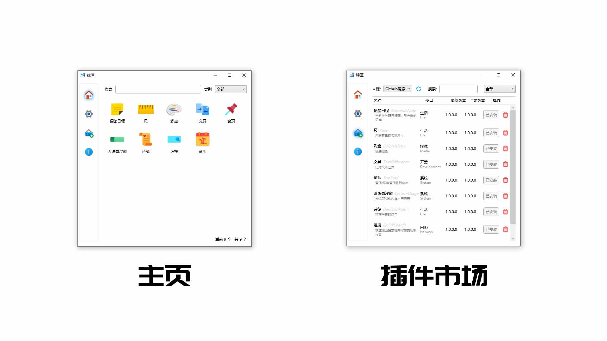
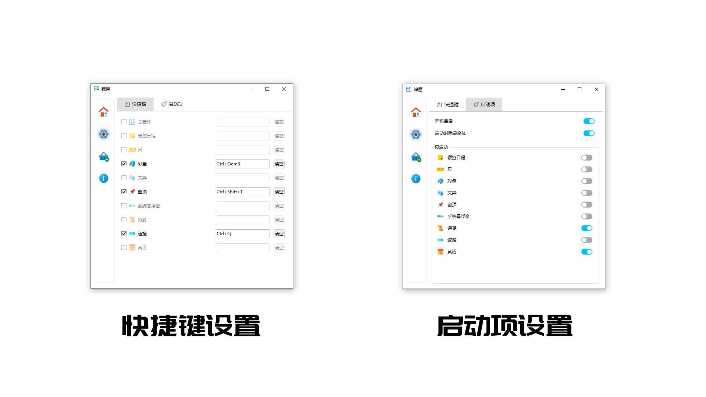

# 锦匣[JinXiaToolBox]
锦匣 重构版，用WPF框架重写，提升视觉效果和性能，还用了MEF式插件结构，允许自由安装和卸载插件，也可以自行[编写插件](https://github.com/tp1415926535/JinXiaPluginExample)。      

     
    
     

## 下载（v 2.2.0.6）

- [Github-依赖.Net6.0](https://github.com/tp1415926535/JinXiaToolBox/blob/main/%E9%94%A6%E5%8C%A3v2.2.0.6-%E4%BE%9D%E8%B5%96.NET6.0.zip)
- [蓝奏云-独立](https://wwvr.lanzn.com/iX9812mva5ri)
- [蓝奏云-依赖.Net6.0](https://wwvr.lanzn.com/i8RNN2mva4yj)

## 更新日志
* v2.2.0.6 2025/2/6 补充窗体隐藏时不显示请求失败提示
* v2.2.0.5 2025/1/10 窗体隐藏时不显示请求失败提示，修复可能的导入时间过长提示出错
* v2.2.0.4 2024/12/30 修复程序锁中文的潜在错误
* v2.2.0.3 2024/12/27 修复下载进度监控组件被释放导致下载失败
* v2.2.0.2 2024/12/23 修复卸载后重装插件保存快捷键报错
* v2.2.0.1 2024/12/23 滚动条样式优化；允许导航栏在高度不够时滚动
* v2.2.0.0 2024/12/21 设置和插件市场并入主窗口，统一界面。设置变更改为自动保存无需询问。
* v2.1.1.0 2024/12/19 下载插件增加进度显示，优化进度定义
* v2.1.0.0 2024/12/19 插件接口结构调整，允许插件配置保留迁移。
* v2.0.1.0 2024/12/18 允许在加载插件失败时卸载插件源；修复部分dll加载失败导致插件报错并且整个插件列表清空；修复下载失败，增加下载源；调整设置保存提示
* v2.0.0.0 2024/12/12 完成主窗口的MEF插件式的WPF框架重写
